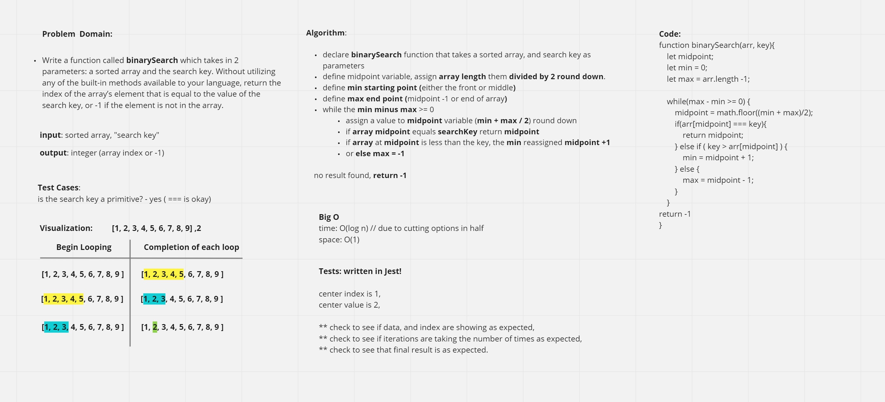

# Code Challenge 3

## BinarySearch

Write a function called BinarySearch which takes in 2 parameters: a sorted array and the search key. Without utilizing any of the built-in methods available to your language, return the index of the array’s element that is equal to the value of the search key, or -1 if the element is not in the array.

## Whiteboard-Process

## Approach & Efficiency

The approach taken is to go at for the center of a range of numbers to greatly decrease the size of the search as well as the number of iterations to complete a successful search.
