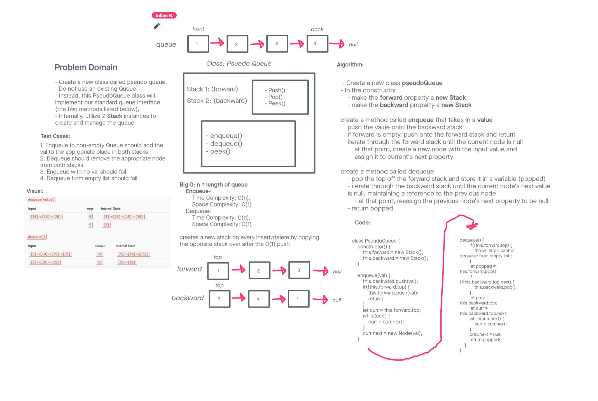

# Challenge Summary

- Create a new class called pseudo queue.

- Do not use an existing Queue.

- Instead, this PseudoQueue class will implement our standard queue interface (the two methods listed below),

- Internally, utilize 2 Stack instances to create and manage the queue

## Whiteboard Process

## Approach & Efficiency

We created a constructor to make forward and backward properties, then methods for enqueueing and dequeueing in order to go to the corrects areas and take the appropriate actions.

## Solution

class PseudoQueue {

 constructor() {

  this.forward = new Stack();

  this.backward = new Stack();

 }

 enqueue(val) {

  this.backward.push(val);

  if(!this.forward.top) {

   this.forward.push(val);

   return;

  }

  let curr = this.forward.top;

  while(curr) {

   curr = curr.next;

  }

  curr.next = new Node(val);

 }

 3dequeue() {

  if(!this.forward.top) {

   throw 'Error: cannot dequeue from empty list';

  }

  let popped = this.forward.pop();

  if (!this.backward.top.next) {

   this.backward.pop();

  }

  let prev = this.backward.top;

  let curr = this.backward.top.next;

  while(curr.next) {

   curr = curr.next;

  }

  prev.next = null;

  return popped;

 }

}
