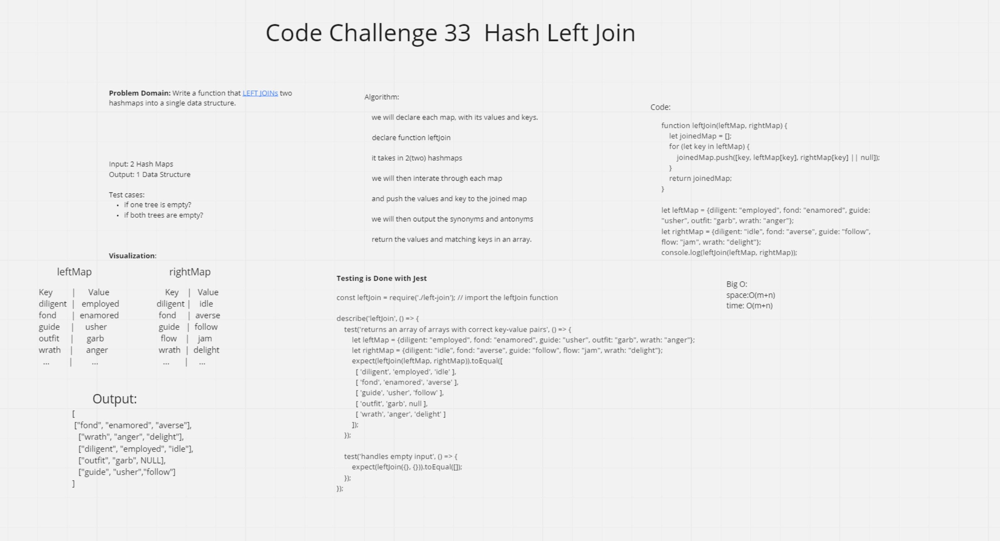

# Code Challenge 33

## Problem Domain

Write a function that LEFT JOINs two hashmaps into a single data structure.

## Whiteboard-Process

## Approach & Efficiency

 Our method of solving the problem was to take in the tables and then to push the values to the same array with their matching key.
 It resulted in a an array where the key words has its synonym and antonym in the same array.
