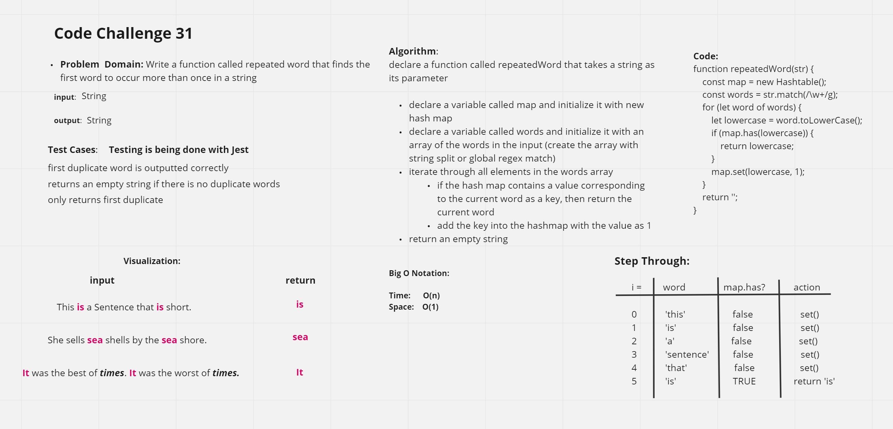

# Code Challenge 31

## Problem Domain

Write a function called repeated word that finds the first word to occur more than once in a string.

## Whiteboard-Process

## Approach & Efficiency

We wemt with a function that takes in a string and then it goes through a regex function.  It checks for the first repeated word to set the map function boolean to True.

