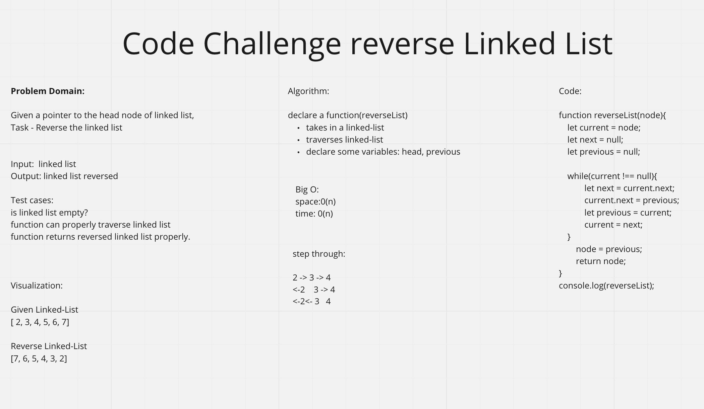

# Code Challenge 33

## Problem Domain

Given a pointer to the head node of a linked list, the task is to reverse the linked list. We need to reverse the list by changing the links between nodes.

## Whiteboard-Process

## Approach & Efficiency

I interviewed Raphael and we went with 45 min to simulate a real whiteboard.

We used [This](https://www.geeksforgeeks.org/reverse-a-linked-list/) as reference.

Total whitebaording time waws 36 min. we reviewed the soltuion for a bit afterwards,
Tommorrow 1/17/23 I will be interviewed by Raphael.

