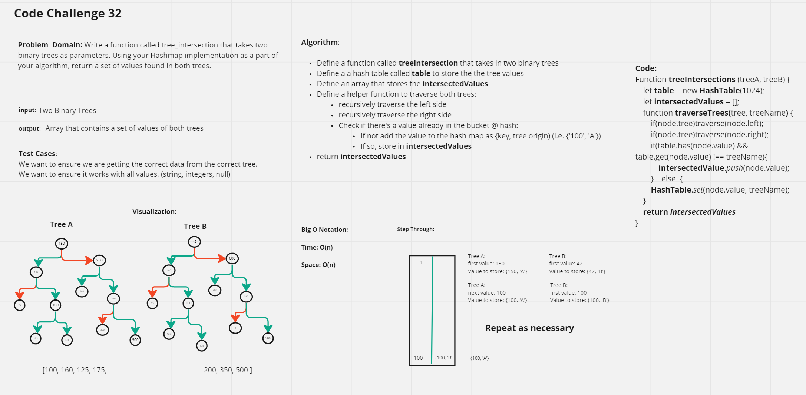

# Code Challenge 32

## Problem Domain

Write a function called tree_intersection that takes two binary trees as parameters.
Using your Hashmap implementation as a part of your algorithm, return a set of values found in both trees.

## Whiteboard-Process

## Approach & Efficiency

 Our method of solving the problem was to take in the two trees, and take the values useing the get method and putting them into the hash table from the first tree. Then
 we input the following tree and push all of the the matching values into our intersected values array.

